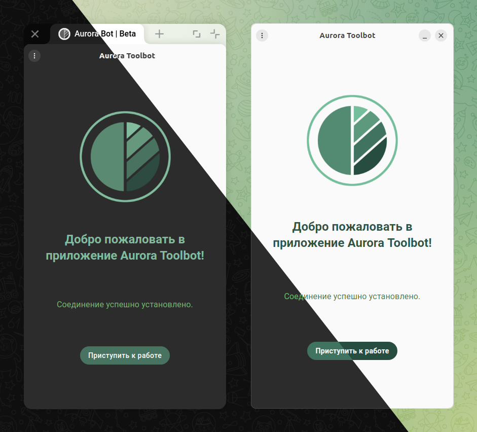

# Aurora Toolbot

> Subscribe and like ⭐

Aurora Toolbot is an application with a graphical interface that implements all the functionality of the main application [Aurora Bot](https://github.com/keygenqt/aurora-bot).
The application works using Flatpak, in an isolated environment, referring to the Aurora Bot application through the D-Bus service, which directly performs the main work.



### Features

- Interaction with devices.
- Interaction with emulators.
- Working with [Aurora SDK](https://developer.auroraos.ru/doc/sdk).
- Working with [Platform SDK](https://developer.auroraos.ru/doc/sdk/psdk).
- Working with [Flutter SDK](https://developer.auroraos.ru/doc/extended/flutter).
- Answers to questions.

### Install

1. Install [Aurora Bot](https://github.com/keygenqt/aurora-bot).
3. Download flatpak file from [releases](https://github.com/keygenqt/aurora-toolbot/releases).
4. Install: `flatpak install --user aurora-toolbot_0.0.4_amd64.flatpak`

### License

```
Copyright 2025 Vitaliy Zarubin

Licensed under the Apache License, Version 2.0 (the "License");
you may not use this file except in compliance with the License.
You may obtain a copy of the License at

    https://www.apache.org/licenses/LICENSE-2.0

Unless required by applicable law or agreed to in writing, software
distributed under the License is distributed on an "AS IS" BASIS,
WITHOUT WARRANTIES OR CONDITIONS OF ANY KIND, either express or implied.
See the License for the specific language governing permissions and
limitations under the License.
```
