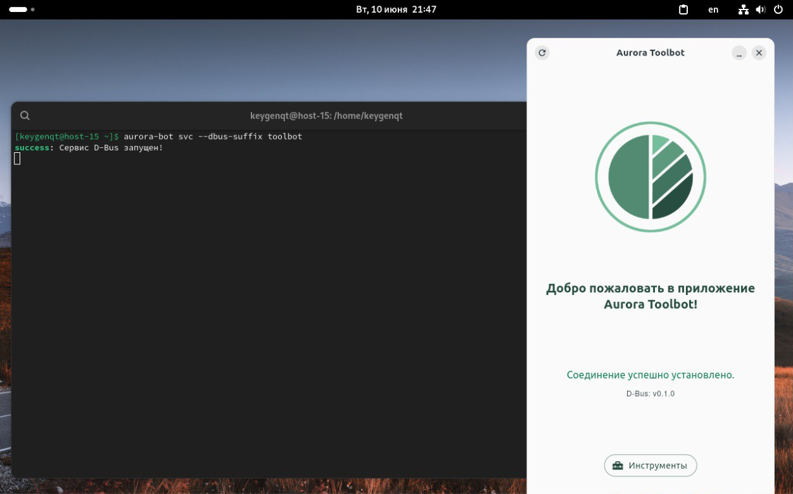

# Aurora Toolbot

> Subscribe and like ⭐

A [React](https://react.dev/) app that implements [Telegram Mini Apps](https://core.telegram.org/bots/webapps) and native apps using [Tauri](https://v2.tauri.app/) - GUI for [Aurora Bot](https://github.com/keygenqt/aurora-bot). An application that provides easy management of the Aurora OS ecosystem.

> The application is under development.



### Features

- `Emulator` - Manage your Aurora OS emulators.
- `Device` - Manage your Aurora OS devices.
- `Aurora SDK` - Install and manage Aurora SDK on your PC.
- `Platform SDK` - Install and manage Platform SDK on your PC
- `Flutter SDK` - Install and manage Flutter SDK on your PC
- `Faq` - Get answers to your questions.

[More...](https://aurora-bot.keygenqt.com/book/aurora-toolbot/about.html)

### Install

1. Install [Aurora Bot](https://github.com/keygenqt/aurora-bot).
2. Install VirtualBox: `sudo apt install virtualbox`
3. Download flatpak file from [releases](https://github.com/keygenqt/aurora-toolbot/releases).
4. Install: `flatpak install --user aurora-toolbot_0.0.1_amd64.flatpak`

### License

```
Copyright 2025 Vitaliy Zarubin

Licensed under the Apache License, Version 2.0 (the "License");
you may not use this file except in compliance with the License.
You may obtain a copy of the License at

    https://www.apache.org/licenses/LICENSE-2.0

Unless required by applicable law or agreed to in writing, software
distributed under the License is distributed on an "AS IS" BASIS,
WITHOUT WARRANTIES OR CONDITIONS OF ANY KIND, either express or implied.
See the License for the specific language governing permissions and
limitations under the License.
```
